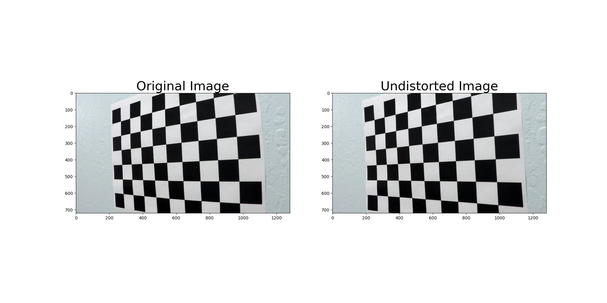
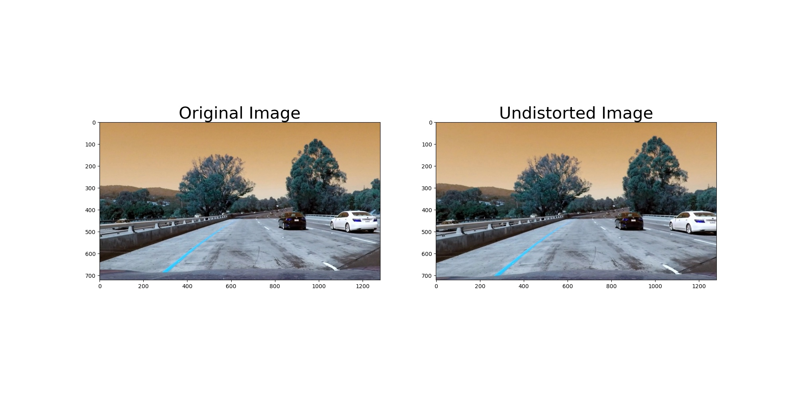
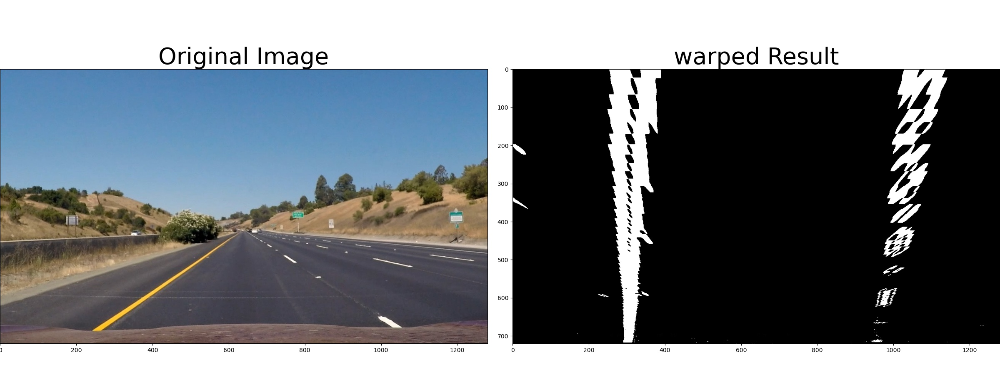
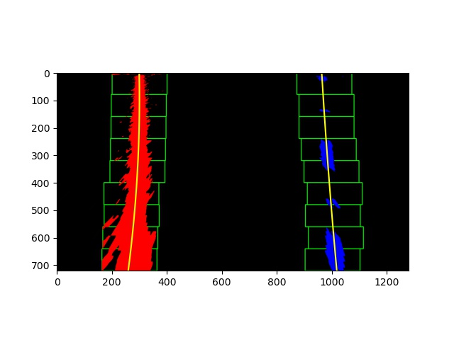
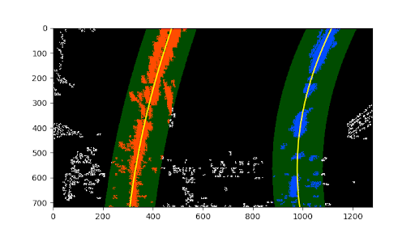
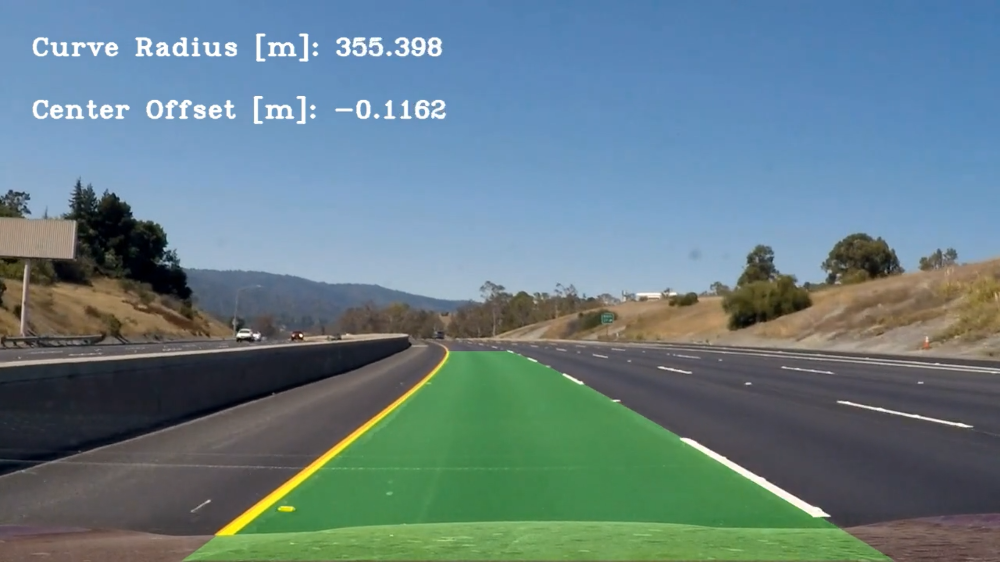

# **Advance Lane Line Detection**

## **Introduction**

The goals/steps of this project are the following:

* Compute the camera calibration matrix and distortion coefficients given a set of chessboard images.
* Apply a distortion correction to raw images.
* Use color transforms, gradients, etc., to create a thresholded binary image.
* Apply a perspective transform to rectify binary image ("birds-eye view").
* Detect lane pixels and fit to find the lane boundary.
* Determine the curvature of the lane and vehicle position with respect to center.
* Warp the detected lane boundaries back onto the original image.
* Output visual display of the lane boundaries and numerical estimation of lane curvature and vehicle position.


### Here I will consider the points individually and describe how I addressed each point in my implementation.  


### Camera Calibration

#### 1. Briefly state how you computed the camera matrix and distortion coefficients. Provide an example of a distortion corrected calibration image.

The code for this step is contained in the code cell of the IPython notebook located in finalPipeline.ipynb

I start by preparing "object points", which will be the (x, y, z) coordinates of the chessboard corners in the world. Here I am assuming the chessboard is fixed on the (x, y) plane at z=0, such that the object points are the same for each calibration image.  Thus, `objp` is just a replicated array of coordinates, and `objpoints` will be appended with a copy of it every time I successfully detect all chessboard corners in a test image.  `imgpoints` will be appended with the (x, y) pixel position of each of the corners in the image plane with each successful chessboard detection.  

I then used the output `objpoints` and `imgpoints` to compute the camera calibration and distortion coefficients using the `cv2.calibrateCamera()` function.  I applied this distortion correction to the test image using the `cv2.undistort()` function and obtained this result: 



### Pipeline (single images)

#### 1. Provide an example of a distortion-corrected image.

To demonstrate this step, I will describe how I apply the distortion correction to one of the test images like this one:



#### 2. Describe how (and identify where in your code) you used color transforms, gradients or other methods to create a thresholded binary image.  Provide an example of a binary image result.

I used a combination of color and gradient thresholds to generate a binary image. I first used the HLS color transform to seprate the Hue and Saturation channels and then applied abstract Sobel Operator threshold to further refine the image for edge detections. Finally, I combined them all into a combined threshold binary image. 

Here's an example of my output for this step.


#### 3. Describe how (and identify where in your code) you performed a perspective transform and provide an example of a transformed image.

The code for my perspective transform includes a function called `warp()`, which appears in code cell of the IPython notebook.  The `warp()` function takes as inputs an image (`img`). Once into the function it creates variables such as source (`src`) and destination (`dst`) points.  I chose the hardcode the source and destination points in the following manner:

```python
src = np.float32(
    [[(img_size[0] / 2) - 55, img_size[1] / 2 + 100],
    [((img_size[0] / 6) - 10), img_size[1]],
    [(img_size[0] * 5 / 6) + 60, img_size[1]],
    [(img_size[0] / 2 + 55), img_size[1] / 2 + 100]])
dst = np.float32(
    [[(img_size[0] / 4), 0],
    [(img_size[0] / 4), img_size[1]],
    [(img_size[0] * 3 / 4), img_size[1]],
    [(img_size[0] * 3 / 4), 0]])
```

This resulted in the following source and destination points:

| Source        | Destination   | 
|:-------------:|:-------------:| 
| 585, 460      | 320, 0        | 
| 203, 720      | 320, 720      |
| 1127, 720     | 960, 720      |
| 695, 460      | 960, 0        |

I verified that my perspective transform was working as expected by drawing the `src` and `dst` points onto a test image and its warped counterpart to verify that the lines appear parallel in the warped image.



#### 4. Describe how (and identify where in your code) you identified lane-line pixels and fit their positions with a polynomial?

##### Lane line detection using Histogram:

Lane line detection is performed on this transformed binary thresholded image that has already been undistorted and warped. Initially a histogram is computed on the image which gives us the means that the pixel values are summed on each column to detect the most probable positions of the lane lines in the picture.

We use the sliding window technique which starts from the base position of the image and goes for an upward seraching for line pixels. Lane pixels are considered when the x and y coordinates are within the area defined by the window. when enough pixels are detected, their average position is computed and kept as starting point for the next upward window.

All these pixels are put together in a list of their x and y coordinates. This is done symmetrically on both lane lines. Then a second-degree polynomial is fitted on each left and right side to find the best line fit of the selected pixels. Following is the result which I obtained.



##### Lane line detection based on previous cycle:

The lane detection using histogram is somewhat a time consuming process. So to speed this process, I used lane line search from one video frame to the next frame. Information from the previous video frame is used to detect the line in current frame. For this we will use polynomial fit for the lane lines of the previous image to define the search area. Following is the result obtained from using this techique.



#### 5. Describe how (and identify where in your code) you calculated the radius of curvature of the lane and the position of the vehicle with respect to center.

To calculate the radius and the vehicle position on the road in meters, scaling factors are needed to convert from pixels. The scaling values are 30 meters to 720 pixels in the y-direction and 3.7 meters to 700 pixels in the x-dimension. A polynomial fit is used to make the coversion. Using the x-coordinates of the aligned pixels from the fitted line of each lane line. This conversion factors are applied and polynomial fit is performaed on each lane line.

The radius of curvature is calculated using the y-point at the bottom of the image. To calculate the vehicle position, the polynomial fit in pixels is used to determine the x-position of the left and right lane corresponding to the y at teh bottom of the image.

The average of these 2 values gives the position of the center of the lane in the image. If the lane's center is shifted to the right by 'n' amount of pixels that means that the car is shifted to the left by 'n*xm_per_pix'. This is based on the assumption that the camera is mounted on the central axis of the vehicle. 

#### 6. Provide an example image of your result plotted back down onto the road such that the lane area is identified clearly.

Here is an example of my result on a test image:



---

### Pipeline (video)

#### 1. Provide a link to your final video output.  Your pipeline should perform reasonably well on the entire project video (wobbly lines are ok but no catastrophic failures that would cause the car to drive off the road!).

Here's a [link to my video result](project_video_output.mp4)

---

### Discussion

#### 1. Briefly discuss any problems / issues you faced in your implementation of this project.  Where will your pipeline likely fail?  What could you do to make it more robust?

For successfully completing this project, I had to compute the camera calibration matrix and distortion coefficient which is one of the important steps in image processing. Once these coefficients were obtained, I was able to apply the distortion correction to a raw image. After that, using color transfors, gradients, slobel operators, I was able to create a binary image. Then with the help of perspective transform I was able to retify this binary image into birds-eye view which further helps use to work with curved lanes. With the help of histogram we were then able to detect lane pixels and fit them to find the lane boundaries.

We were also able to compute the radius of curvature of the lane and vehicle position with respect to the center of the lane and then output these visual details on the video.

This setup works well when the road is well lit and when the lanes are clearly delimited. However, this setup starts struggling when it encounters different patch color patch on road or a a contineous line like making running parallel to the lane line markings. This issue of dealing with different color shaded on road surface can be easily solved by modifying the color threshold and working with source and destination points during warping function. This changes will be further worked upon and commited into the code.
